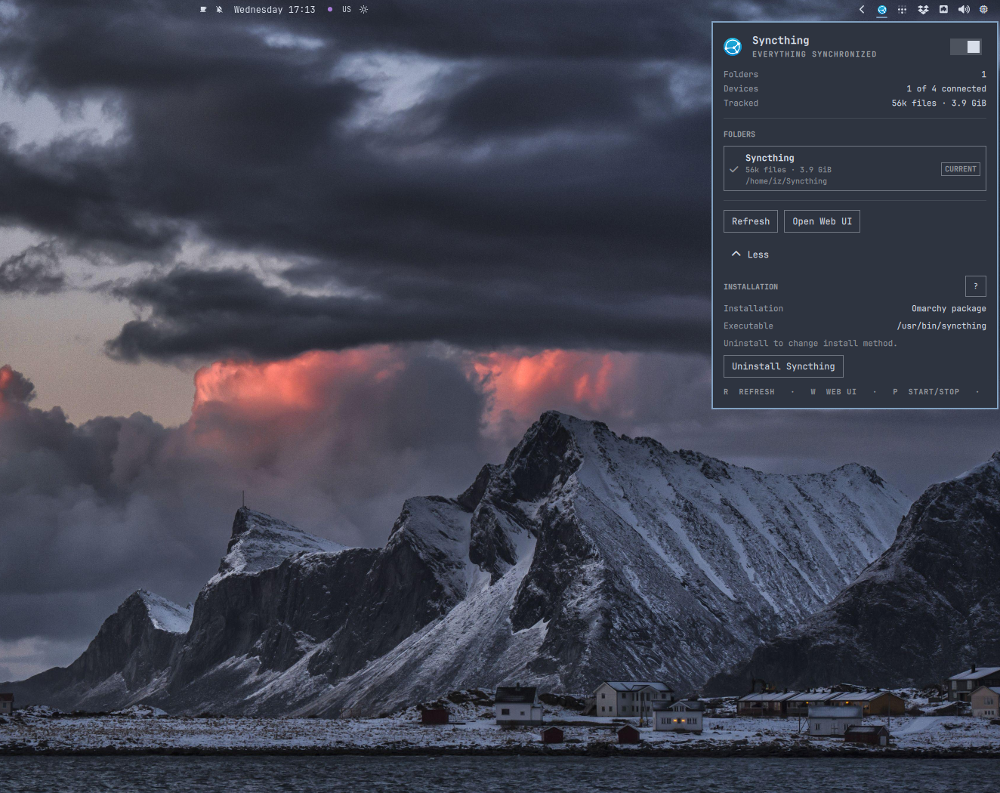

# Syncthing for Omarchy

See Syncthing health and file activity from the Omarchy bar. The plugin can
manage local folders, open Syncthing's Web UI, control the user service, and
install the official Arch package.



## Install

```bash
omarchy plugin add https://github.com/ilyaZar/omarchy-syncthing.git --enable
```

Open the widget and expand **More**. If Syncthing is missing, select **Install
Syncthing**. The plugin runs `omarchy pkg add syncthing`, then enables and
starts `syncthing.service`.

## Use

- Select the switch beside **Syncthing** to start or stop the user service.
- Select a folder card to open its directory.
- Select **+** to configure an existing local directory.
- Select **Refresh** to request an immediate health update.
- Select **Open Web UI** for device setup and advanced folder options.
- Enable the widget's themed-icon setting to tint the bar icon.

| Key   | Action                    |
| ----- | ------------------------- |
| `R`   | refresh status            |
| `W`   | open the Web UI           |
| `P`   | start or stop the service |
| `M`   | show or hide More         |
| `Q`   | close the panel           |
| `Esc` | close the panel           |

## Demo

> [!WARNING]
> The Hyprland window to the left of the plugin is not part of the plugin. It
> live-tracks changes in the `test-source` directory for the demonstration.

The demo shows folder creation, file activity, the local Web UI, and removing a
folder configuration without deleting its files.

<https://github.com/user-attachments/assets/445066ac-68db-4abb-9e2e-68943c348f9b>

### File activity

The plugin reports only state exposed by Syncthing:

- Blue identifies synchronization or an indexed addition.
- Red identifies an indexed entry with `deleted=true`.
- Green identifies remote download progress, which is an upload from this
  device.

Syncthing does not expose a reliable source-to-destination relationship for a
rename or move, so the plugin does not guess one from nearby additions and
deletions.

## Manage folders

**UNLINK** pauses the selected folder and **LINK** resumes it. Both actions use
Syncthing's reversible `paused` setting; they do not create filesystem links or
change device sharing.

**FORGET** is available for an unlinked folder. It removes that folder from the
local Syncthing configuration without deleting its directory or data. Its
Folder ID, settings, and device list are no longer retained by the plugin.

Adding a folder requires an existing directory and a unique Folder ID. The path
is canonicalized, and paths that duplicate, contain, or sit inside another
configured folder are rejected. A new folder is local-only unless remote
devices are explicitly selected.

Pending unencrypted folder offers can prefill the Folder ID, label, and offering
device. Encrypted offers and sharing with untrusted devices must be configured
in the Web UI.

A shared folder must use the same Folder ID on every device. Labels and paths
may differ. Create the folder on one device, share it, and accept the offer on
the other devices rather than creating unrelated folder identities.

See Syncthing's
[Getting Started guide](https://docs.syncthing.net/intro/getting-started.html)
and
[folder guide](https://docs.syncthing.net/intro/gui.html)
for device pairing and sharing.

Folder management uses Syncthing's granular configuration API and requires
Syncthing 1.12.0 or later.

## Remove

Remove an installation made through Omarchy manually:

```bash
systemctl --user disable --now syncthing.service
omarchy pkg drop syncthing
```

These commands do not remove Syncthing configuration or synchronized files.

Remove the plugin separately:

```bash
omarchy plugin remove io.github.ilyazar.syncthing
```

Removing the plugin does not remove Syncthing or undo folder changes made
through the plugin.

## Security and license

The plugin talks only to Syncthing's local API. It keeps the API key in memory
and does not persist or log it. Like other Omarchy shell plugins, it runs
unsandboxed, and the API key permits Syncthing configuration changes.

Plugin code is MIT licensed. Adapted Syncthing status icons are MPL-2.0; their
source and attribution are documented in `assets/README.md`.
